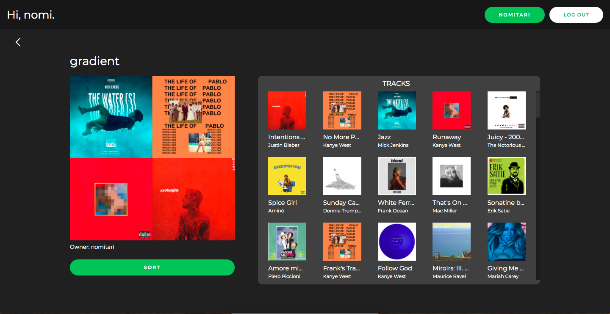
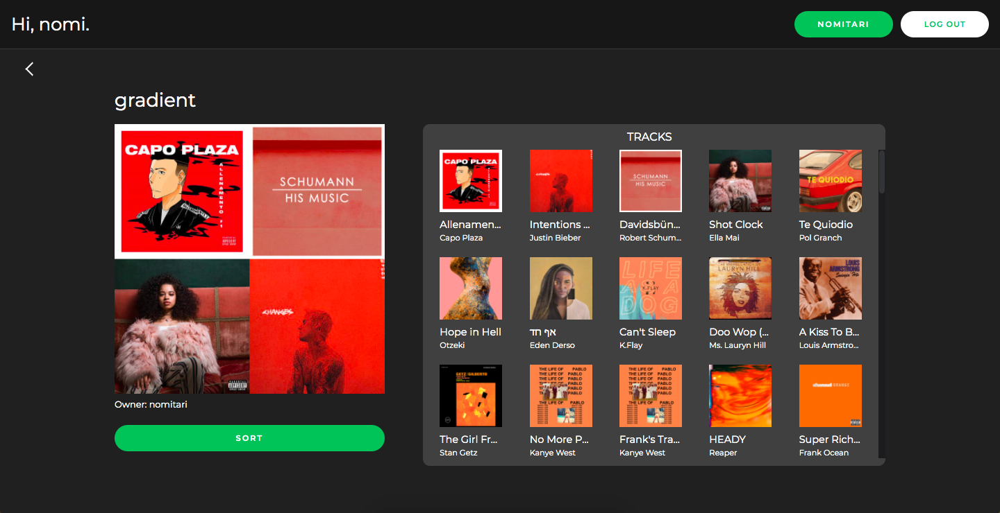

Spotify Gradient
================

This is a web app that uses the Spotify API to sort playlists by their tracks' album artwork. 
You will need spotify credentials to access this application. 

**ACCESS THIS APP HERE**: https://spotify-gradient.herokuapp.com/

================

Spotify Gradient will sort your playlists by the dominant colors of their album artwork.

Before sorting:

After sorting:

This site allows you to view all of the playlists on your profile, each individual playlist and its tracks, and your own Spotify profile.

